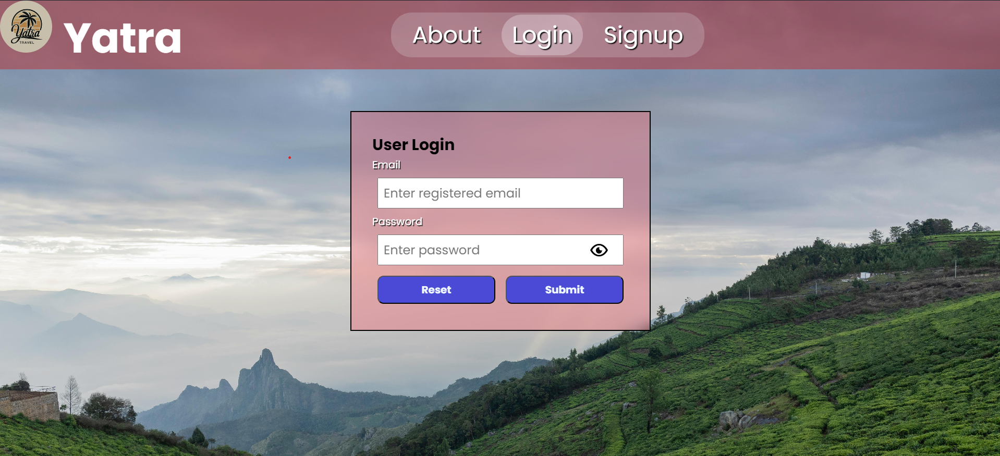
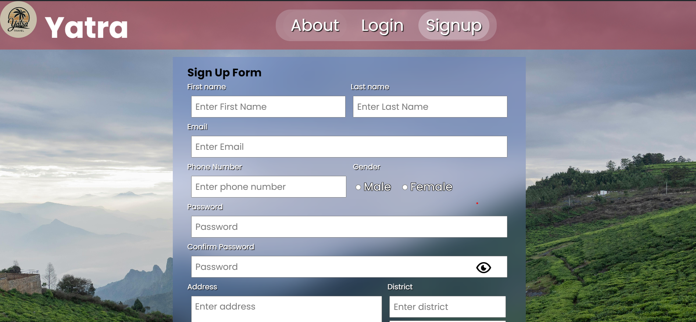

# Yatra

The main objective of the Yatra Travel Agency Website is to create an online    platform dedicated to a travel agency operating in Mangalore. This platform aims to provide a seamless and user-friendly experience for customers to explore, plan, and book travel services related to Mangalore tours

## Technologies

+ **Frontend** - HTML,CSS,JS
+ **Backend**  - PHP
+ **Database** - mySQL
+ **Server** - XAMPP (Apache Server)
## Features

-	User registration and login functionality
-	Admin login for managing website content and user accounts
-	Integration of local guides and tour operators
-	User-friendly interface showcasing various travel packages

## Screenshots

### Login

### Signup

### UserHomePage

### Employee Home Page

### Admin Home Page

